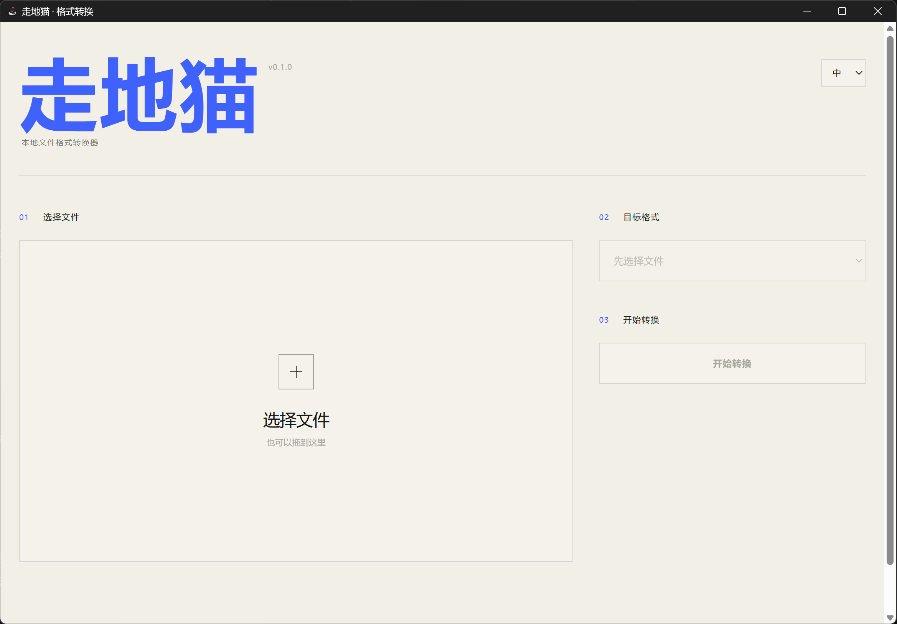

# 走地猫 GroundCat Format

一款克制、极简、离线运行的 Windows 文件格式转换工具。

[](https://github.com/CG1995/groundcat-format/releases/latest)


[下载最新版](https://github.com/CG1995/groundcat-format/releases/latest) · [问题反馈](https://github.com/CG1995/groundcat-format/issues)



## 致敬与来源

走地猫基于 [LaoFeng-mouse/flyingmouse-format](https://github.com/LaoFeng-mouse/flyingmouse-format) 的 **FlyingMouse Format v0.5.0** 改造而来。

感谢原作者 **LaoFeng（LaoFeng-mouse）** 开源完整的离线转换核心与工程基础。走地猫保留其核心转换能力，在此基础上重新设计了产品名称、视觉界面、安装体验和结果保存流程。本项目是独立的社区衍生版本，不代表原作者官方发布。

走地猫基于 FlyingMouse Format v0.5.0 及其当时以 MIT License 发布的历史版本构建（版本与提交记录见 [NOTICE.md](NOTICE.md)）。FlyingMouse 后续已变更许可证；走地猫的 [MIT License](LICENSE) 仅适用于上述历史 MIT 版本代码及走地猫自身的贡献，不适用于 FlyingMouse 后续版本。原作者版权声明和许可文本完整保留。

## v0.1.0

- 极简三步界面：选择文件、选择格式、开始转换。
- 转换完成后自动保存到源文件所在目录。
- 提供“打开所在文件夹”直达按钮。
- 同名结果自动追加序号，不覆盖已有文件。
- 单页 PDF 转 PNG/JPG 直接生成图片；多页 PDF 仍打包 ZIP，避免丢页。
- 默认安装目录为 `C:\Program Files\groundcat`，应用名与快捷方式为“走地猫”。
- 继续支持图片、文本、Office/WPS、PDF、音视频、ZIP、OCR 和批量转换。
- 内置 FFmpeg、LibreOffice、Poppler、Tesseract 等离线转换组件。

## 使用

1. 从 [Releases](https://github.com/CG1995/groundcat-format/releases/latest) 下载 Windows x64 安装包。
2. 安装并打开“走地猫”。
3. 选择文件和目标格式，点击“开始转换”。
4. 结果会自动出现在源文件旁边；可点击按钮直接定位。

> 安装包当前未签名，Windows SmartScreen 可能显示提醒。文件转换在本机完成，不会上传到云端转换服务。

## 从源码运行

源码仓库不包含体积较大的完整离线引擎资源。普通用户请直接下载 Release 安装包；开发者需要自行准备 `bin/` 下对应组件。

```powershell
npm install
npm run desktop
npm test
npm run dist
```

## English

GroundCat Format is a restrained, offline Windows file converter derived from [FlyingMouse Format v0.5.0](https://github.com/LaoFeng-mouse/flyingmouse-format) by **LaoFeng (LaoFeng-mouse)**.

Many thanks to the original author for open-sourcing the conversion core and project foundation. GroundCat redesigns the product identity, UI, installer, and output workflow while retaining the original conversion capabilities. This is an independent community derivative and is not an official release by the upstream author.

Converted files are saved automatically next to their source files. Existing files are never overwritten. Single-page PDFs export directly to PNG/JPG, while multi-page image exports remain ZIP archives so no pages are lost.

GroundCat is built on FlyingMouse Format v0.5.0 and its historical releases published under the MIT License at that time (version and commit records in [NOTICE.md](NOTICE.md)). FlyingMouse has since changed its license; GroundCat's [MIT License](LICENSE) applies only to the code of those historical MIT releases and to GroundCat's own contributions, and does not apply to later FlyingMouse releases. The upstream author's copyright and permission notice are fully preserved.
